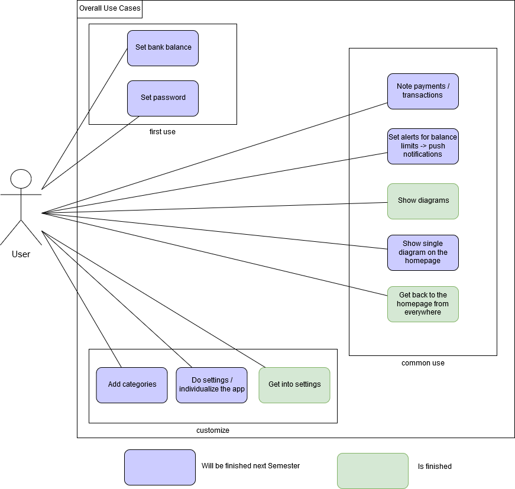

Version 0.9
 
Revision History\
			
| Date       | Version | Description   | Author        |
|------------|---------|---------------|---------------|
| 12/02/2019 | 0.9     | First draft   | Samuel        |

# Software Architecture Document
## 1. Introduction
### 1.1	Purpose
This document provides a comprehensive architectural overview of the system, using a number of different architectural views to depict different aspects of the system. It is intended to capture and convey the significant architectural decisions which have been made on the system.

### 1.2	Scope
This document describes the architecture of the easyFinance App.

#### 1.3	Definitions, Acronyms, and Abbreviations
| Abbreviations		| Discription		| 
|-----------------------|-----------------------|
| n/a			| not applicable	| 
|			| 			| 
|			| 			| 

### 1.4	References
### 1.5	Overview

## 2. Architectural Representation 

## 3. Architectural Goals and Constraints 
There is unfortunately no tool for Flutter
## 4. Use-Case View

## 5. Logical View 
### 5.1	Overview
### 5.2	Architecturally Significant Design Packages

## 6. Process View 
(n/a)

## 7. Deployment View 

## 8. Implementation View 
(n/a)

## 9. Data View (optional)

## 10. Size and Performance
(n/a)

## 11. Quality 
(n/a)
