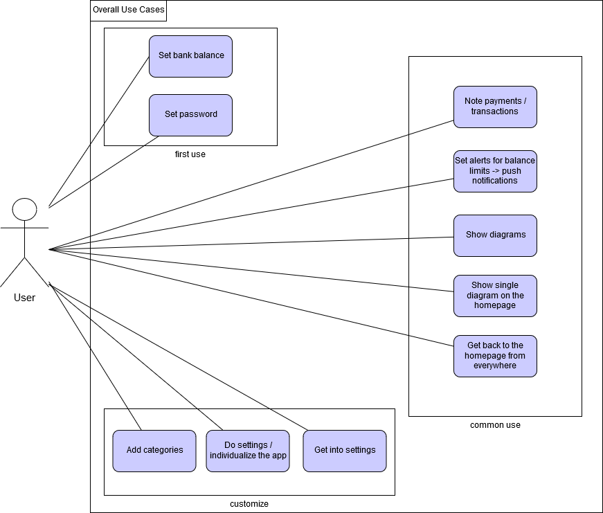
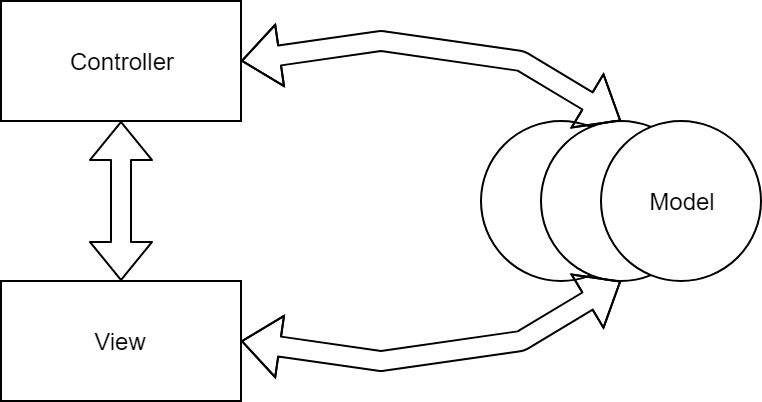
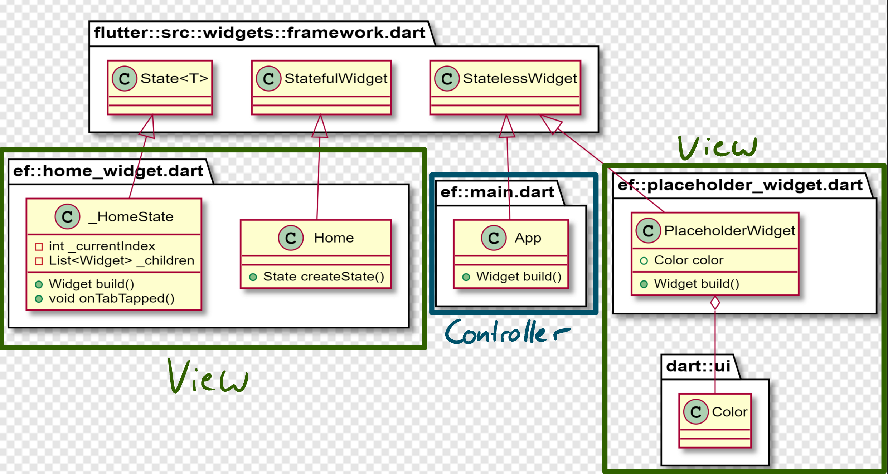
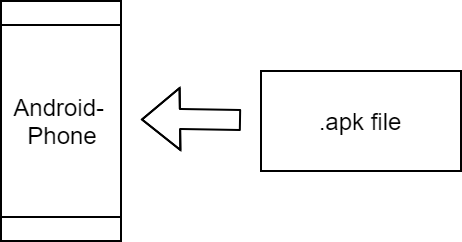

Version 0.9
 
Revision History\
			
| Date       | Version | Description   | Author        |
|------------|---------|---------------|---------------|
| 12/02/2019 | 0.9     | First draft   | Samuel        |

# Software Architecture Document

## Table of Contents
- [1. Introduction](#1-introduction)
    - [1.1 Purpose](#11-purpose)
    - [1.2 Scope](#12-scope)
    - [1.3 Definitions, Acronyms and Abbreviations](#13-definitions-acronyms-and-abbreviations)
    - [1.4 References](#14-references)
- [2. Architectural Representation](#2-architectural-representation)
- [3. Architectural Goals and Constraints](#3-architectural-goals-and-constraints)
- [4. Use-Case View](#4-use-case-view)
- [5. Logical View](#5-logical-view)
    - [5.1 Overview](#51-overview)
- [6. Process View](#6-process-view)
- [7. Deployment View](#7-deployment-view)
- [8. Implementation View](#8-implementation-view)
- [9. Data View](#9-data-view)
- [10. Size and Performance](#10-size-and-performance)
- [11. Quality](#11-quality)

## 1. Introduction
### 1.1	Purpose
This document provides a comprehensive architectural overview of the system, using a number of different architectural views to depict different aspects of the system. It is intended to capture and convey the significant architectural decisions which have been made on the system.

### 1.2	Scope
This document describes the architecture of the easyFinance App.

#### 1.3	Definitions, Acronyms, and Abbreviations
| Abbreviations		| Discription		| 
|-----------------------|-----------------------|
| n/a			| not applicable	| 
|			| 			| 
|			| 			| 

### 1.4	References
| Titel										| Organisation		| 
|-------------------------------------------------------------------------------|-----------------------|
| [easyFinance Blog](https://softwareengineeringtinf18b3.wordpress.com/)	| easyFinanaceTeam	| 
| [Youtrack](https://softwareengeneering.myjetbrains.com/youtrack/dashboard?id=cc5fd7ad-01fa-4339-902c-d544cb31886a) | easyFinacneTeam	| 

## 2. Architectural Representation 

## 3. Architectural Goals and Constraints 
There is unfortunately no tool for Flutter
## 4. Use-Case View

## 5. Logical View
### 5.1	Overview

### 5.2	Architecturally Significant Design Packages

## 6. Process View 
(n/a)

## 7. Deployment View 

## 8. Implementation View 
(n/a)

## 9. Data View
Not finished jet. To be done in the next Week.
## 10. Size and Performance
(n/a)

## 11. Quality 
(n/a)
