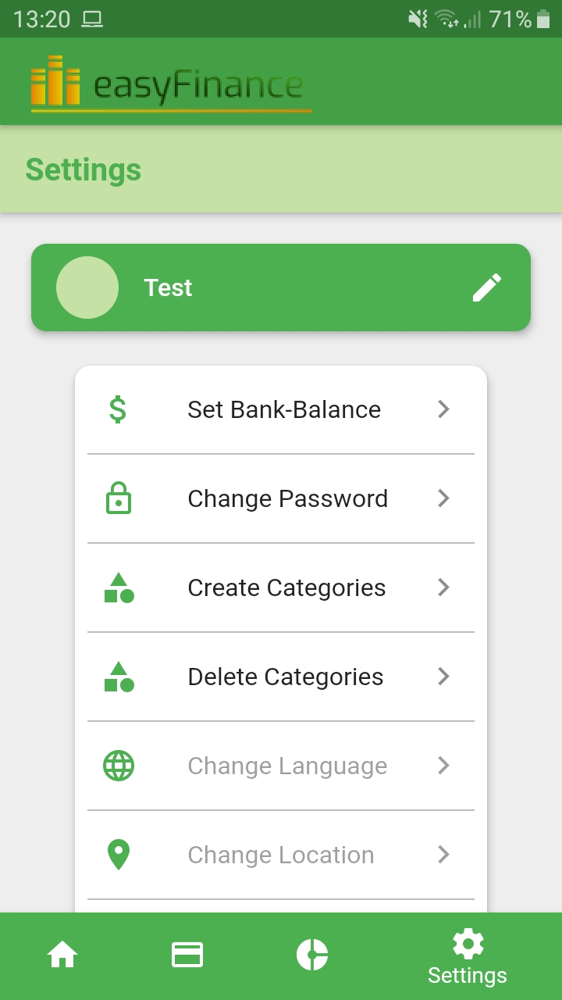
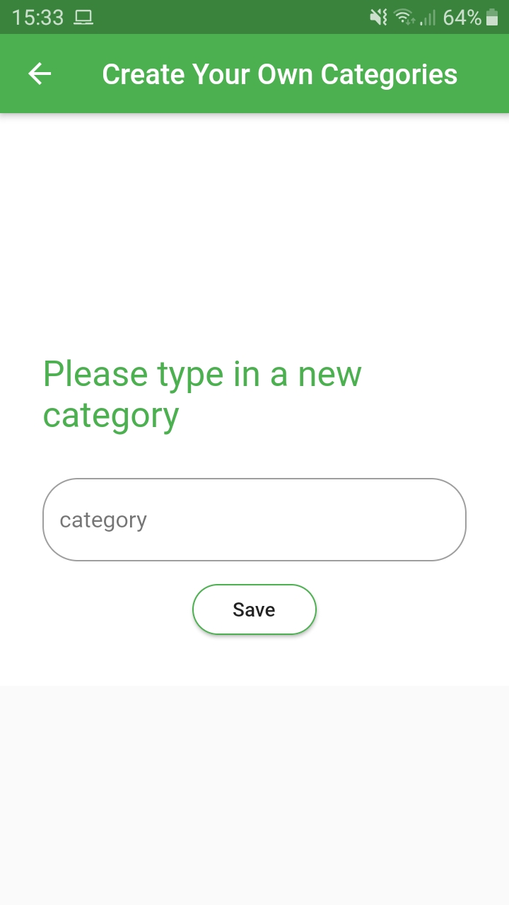
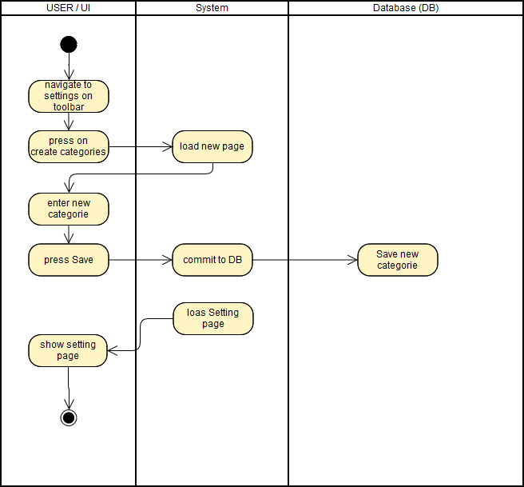

# Use-Case Specification: Create categories

# 1. create categories

## 1.1 Brief Description

The goal of this UseCase is to create new categories.

## 1.2 Screenshots

# 2. Flow of Events

## 2.1 Basic Flow

### Activity Diagram

## 2.2 Alternative Flows
n/a

# 3. Special Requirements
n/a

# 4. Preconditions
The only precondition of this usecase is:

 1. The user has open the app.
 2. The user has navigated the settings page.

# 5. Postconditions

### 5.1 Diagram
The user can add a new categorie.

# 6. Function Points
n/a
