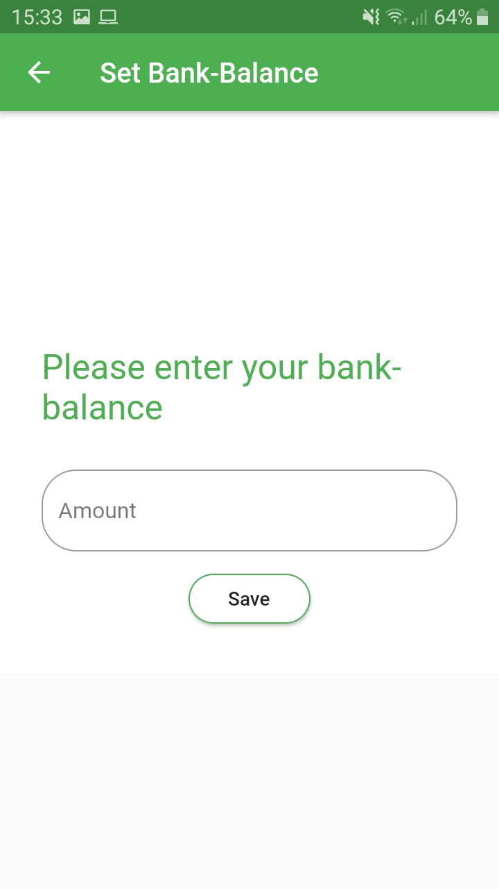
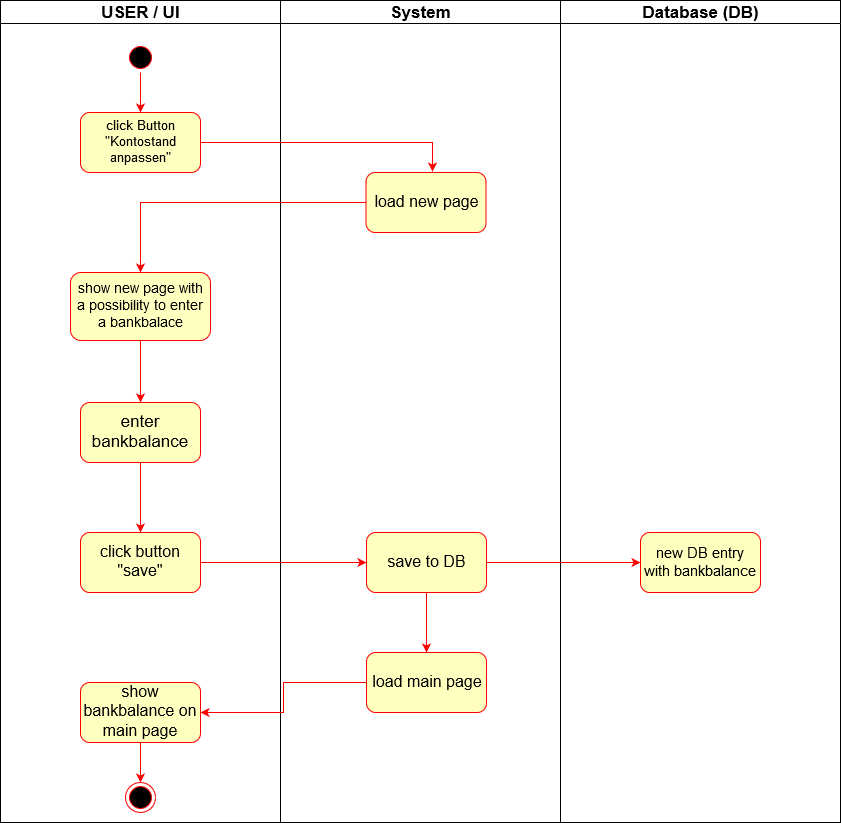
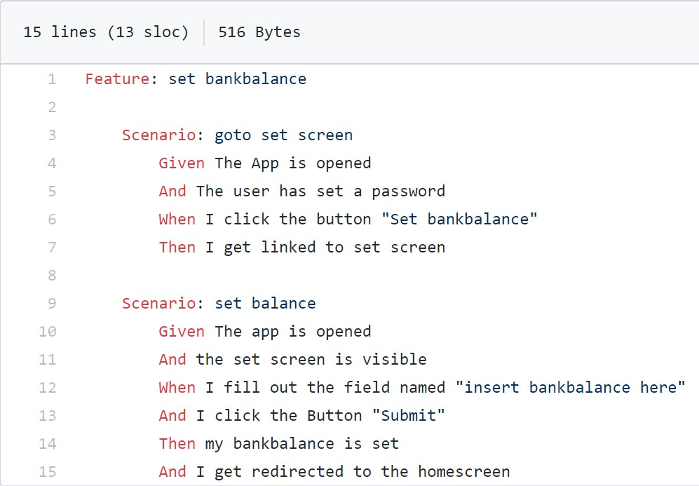

# Use-Case Specification: Set bankbalance

# 1. Set balance

## 1.1 Brief Description

The goal of this UseCase is to set the initial bankbalance, to have a well overview about the actual financial state.

## 1.2 Mockup

## 1.3 Screenshots

# 2. Flow of Events

## 2.1 Basic Flow

### Activity Diagram

### .feature File

## 2.2 Alternative Flows
n/a

# 3. Special Requirements
n/a

# 4. Preconditions
The only precondition of this usecase is:

 1. The user has opend the app once and set a password.

# 5. Postconditions

### 5.1 Diagram
The user can see his actual balance.

# 6. Function Points
18,85 FP
