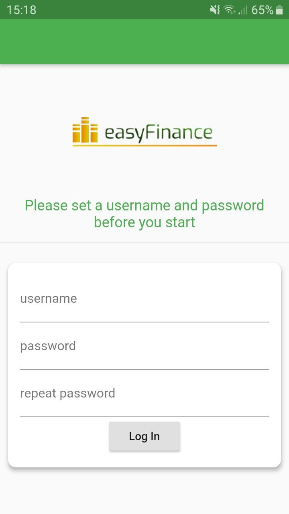
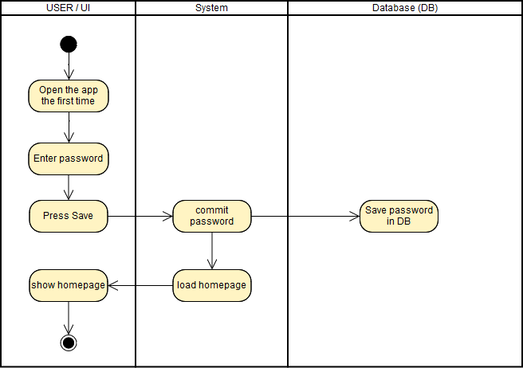

# Use-Case Specification: Set password

# 1. set password

## 1.1 Brief Description

The goal of this UseCase is to set the password of the User who use the app.

## 1.2 Screenshots

# 2. Flow of Events

## 2.1 Basic Flow

### Activity Diagram

## 2.2 Alternative Flows
n/a

# 3. Special Requirements
n/a

# 4. Preconditions
The only precondition of this usecase is:

 1. The user open the app the first time.

# 5. Postconditions

### 5.1 Diagram
The user will have a password which is needed to enter in the app.

# 6. Function Points
14,95 FP
