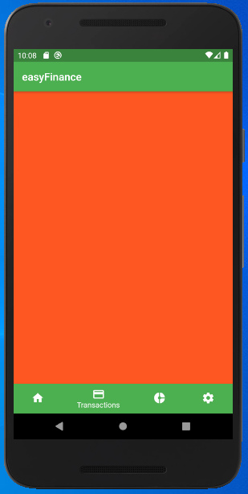
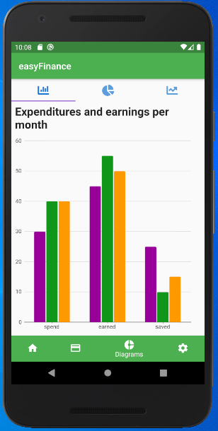
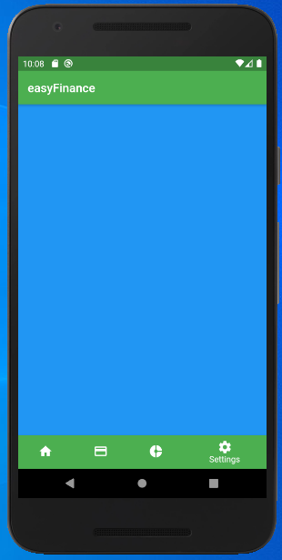
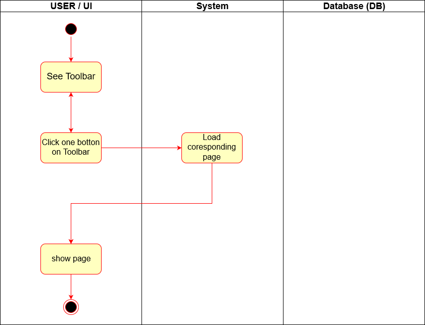

# Use-Case Specification: Toolbar
# 1. Toolbar

## 1.1 Brief Description

The goal of this UseCase is to create a toolbar at the bottom of the app screen.
The toolbar should be always available and makes it possible to simply navigate through the app

## 1.2 Mockup

# 2. Flow of Events

## 2.1 Basic Flow

### Activity Diagram

### .feature File

## 2.2 Alternative Flows
n/a

# 3. Special Requirements
n/a

# 4. Preconditions
The only precondition of this usecase is:

 1. The user has opend the app.

# 5. Postconditions
The user can navigate through the  app.

# 6. Function Points
16 FP
