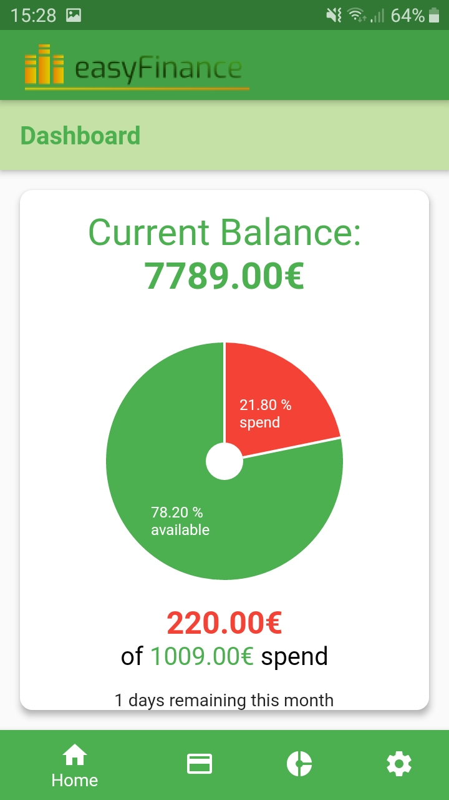
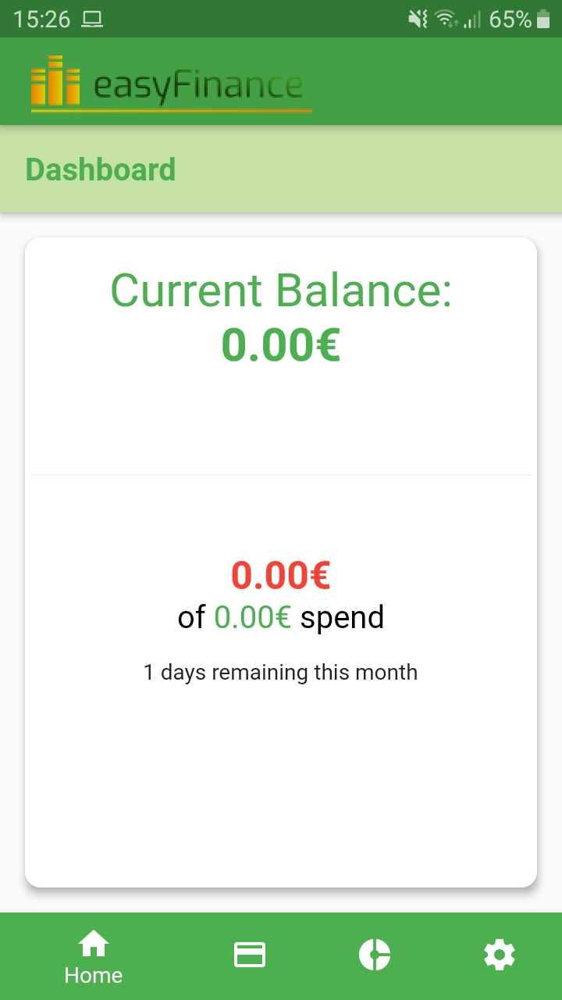
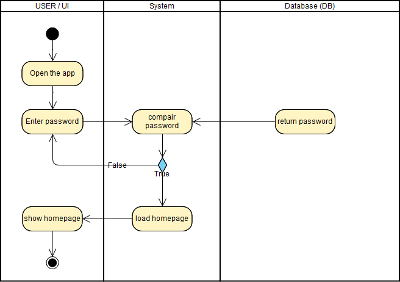

# Use-Case Specification: Show homepage

# 1. show homepage

## 1.1 Brief Description

The goal of this UseCase is to show the main page of our app.

## 1.2 Screenshots

# 2. Flow of Events

## 2.1 Basic Flow

### Activity Diagram

## 2.2 Alternative Flows
n/a

# 3. Special Requirements
n/a

# 4. Preconditions
The only precondition of this usecase is:
n/a

# 5. Postconditions

### 5.1 Diagram
The user will have a nice overview about his additions this month.

# 6. Function Points
20 FP
