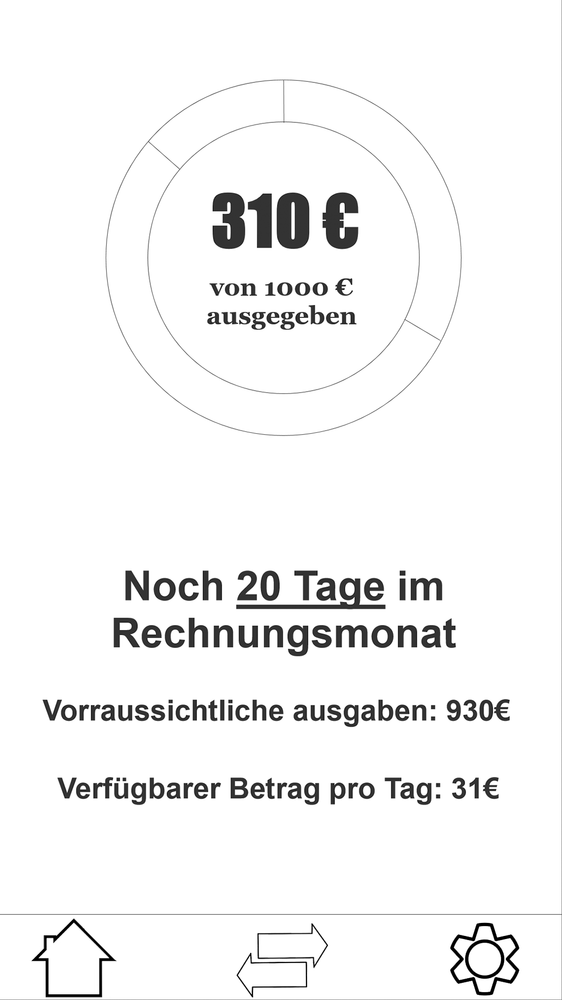
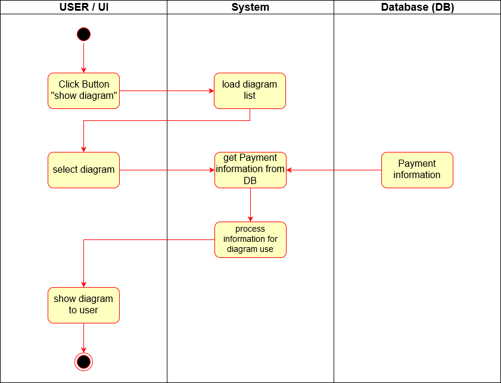

# Use-Case Specification: Show Diagram

# 1. Show Diagram

## 1.1 Brief Description

The goal of this UseCase is to enable the User to see a diagram about his actual balance. How much money is spent, available and maybe blocked.

## 1.2 Mockup

# 2. Flow of Events

## 2.1 Basic Flow

### Activity Diagram

### .feature File
tbd

## 2.2 Alternative Flows
n/a

# 3. Special Requirements
n/a

# 4. Preconditions
The main preconditions for this use case are:

 1. The user has opend the app once and set a password.
 2. The user has set his bankbalance.

# 5. Postconditions

### 5.1 Diagram
The user sees a diagram he has chosen, including his actual balance

# 6. Function Points
n/a
